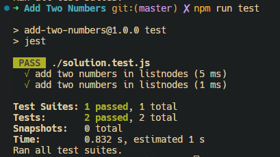
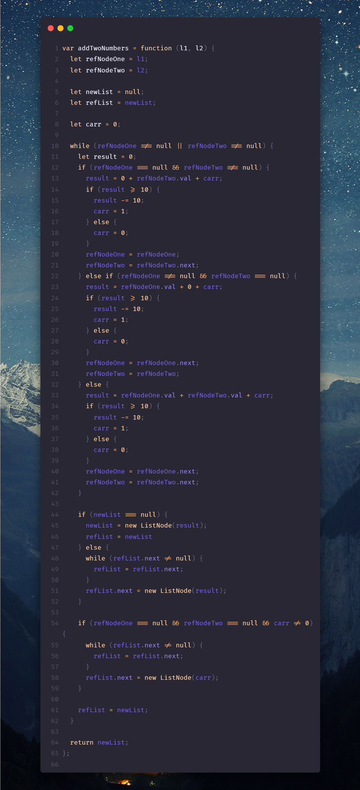

# **Combinar dos listas ordenadas**

Se le dan los encabezados de dos listas enlazadas ordenadas **list1** y **list2**.

Combinar las dos listas en una lista ordenada. La lista debe hacerse empalmando los nodos de las dos primeras listas.

>Devuelve el encabezado de la lista enlazada fusionada.

---
## Example 1:


```
Input: list1 = [1,2,4], list2 = [1,3,4]
Output: [1,1,2,3,4,4]
```

## Example 2:
```
Input: list1 = [], list2 = []
Output: []
```

## Example 3:
```
Input: list1 = [], list2 = [0]
Output: [0]
```
---

## **Restricciones:**

- El número de nodos en ambas listas está en el rango [0, 50].
- 100 <= Nodo.val <= 100
- Tanto **list1** como **list2** se ordenan en orden no decreciente.

---
## **_Solution_:**



