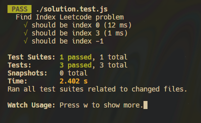
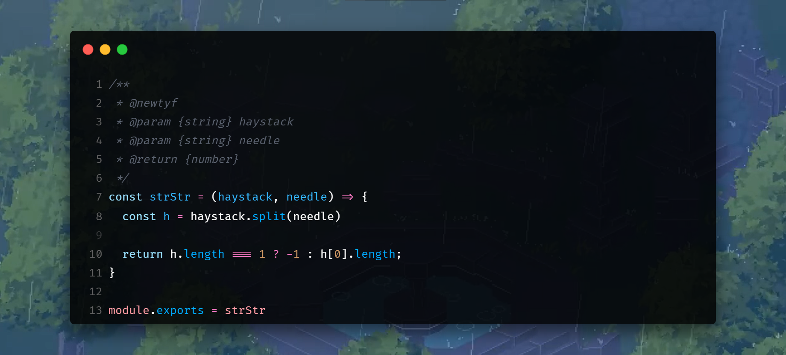

# **Find the Index of the First Occurrence in a String**

Example 1:
```javascript
Input: a = "sadbutsad", b = "sad"
Output: "0"
```


Example 2:
```javascript
Input: a = "butsadbut", b = "sad"
Output: "3"
```

# Solution


