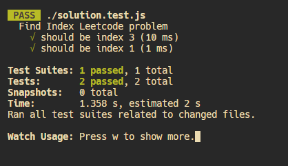
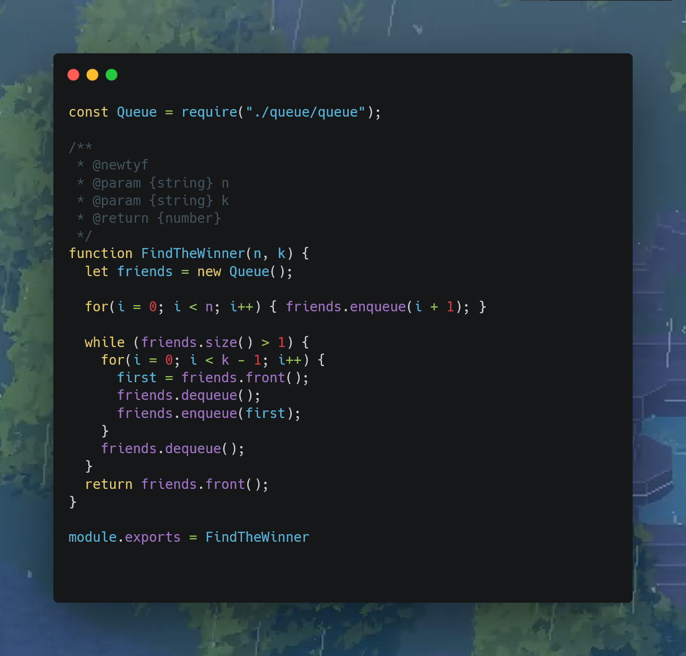

# **Find the Winner of the Circular Game**

Example 1:
```javascript
Input: n = 5, k = 2
Output: 3

/*
Explanation: Here are the steps of the game:
1) Start at friend 1.

2) Count 2 friends clockwise, which are friends 1 and 2.

3) Friend 2 leaves the circle. Next start is friend 3.

4) Count 2 friends clockwise, which are friends 3 and 4.

5) Friend 4 leaves the circle. Next start is friend 5.

6) Count 2 friends clockwise, which are friends 5 and 1.

7) Friend 1 leaves the circle. Next start is friend 3.

8) Count 2 friends clockwise, which are friends 3 and 5.

9) Friend 5 leaves the circle. Only friend 3 is left, so they are the winner.
*/
```


Example 2:
```javascript
Input: n = 6, k = 5

Output: 1

// Explanation: The friends leave in this order: 5, 4, 6, 2, 3. The winner is friend 1.
```


# Solution


