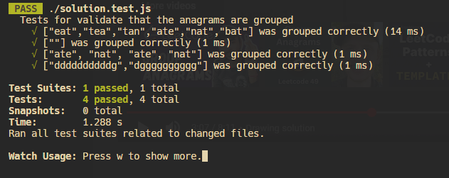
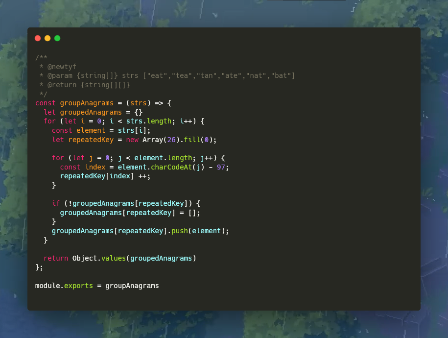

# **49. Group Anagrams**

Example 1:
```javascript

Input: strs = ["eat","tea","tan","ate","nat","bat"]
Output: [["bat"],["nat","tan"],["ate","eat","tea"]]
Explanation:
    There is no string in strs that can be rearranged to form "bat".
    The strings "nat" and "tan" are anagrams as they can be rearranged to form each other.
    The strings "ate", "eat", and "tea" are anagrams as they can be rearranged to form each other.
```


Example 2:
```javascript

Input: strs = [""]
Output: [[""]]
```

# Solution


