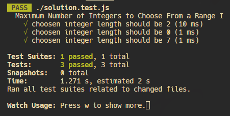
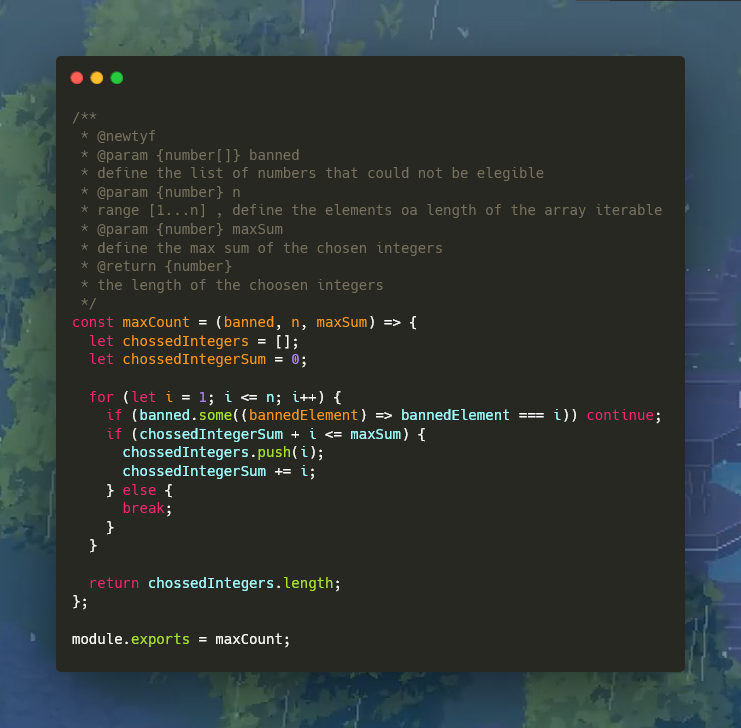

# **Maximum Number of Integers to Choose From a Range I**

### Example 1:
```plaintext
Input: banned = [1, 6, 5], n = 5, maxSum = 6
Output: 2
Explanation: You can choose the integers 2 and 4.
2 and 4 are from the range [1, 5], both did not appear in banned, and their sum is 6, which did not exceed maxSum.
```

### Example 2:
```plaintext
Input: banned = [1, 2, 3, 4, 5, 6, 7], n = 8, maxSum = 1
Output: 0
Explanation: You cannot choose any integer while following the mentioned conditions.
```

### Example 3:
```plaintext
Input: banned = [11], n = 7, maxSum = 50
Output: 7
Explanation: You can choose the integers 1, 2, 3, 4, 5, 6, and 7.
They are from the range [1, 7], all did not appear in banned, and their sum is 28, which did not exceed maxSum.
```

# Solution


