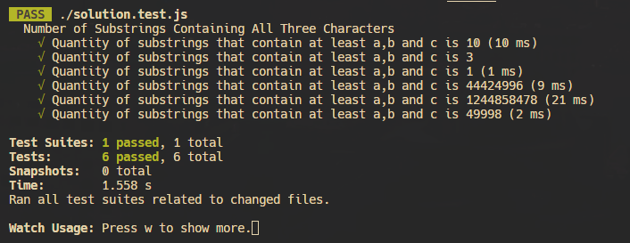
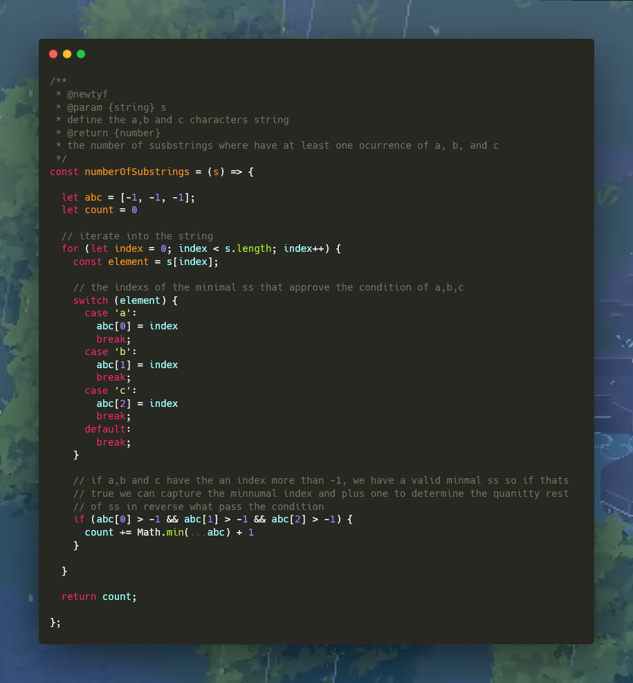
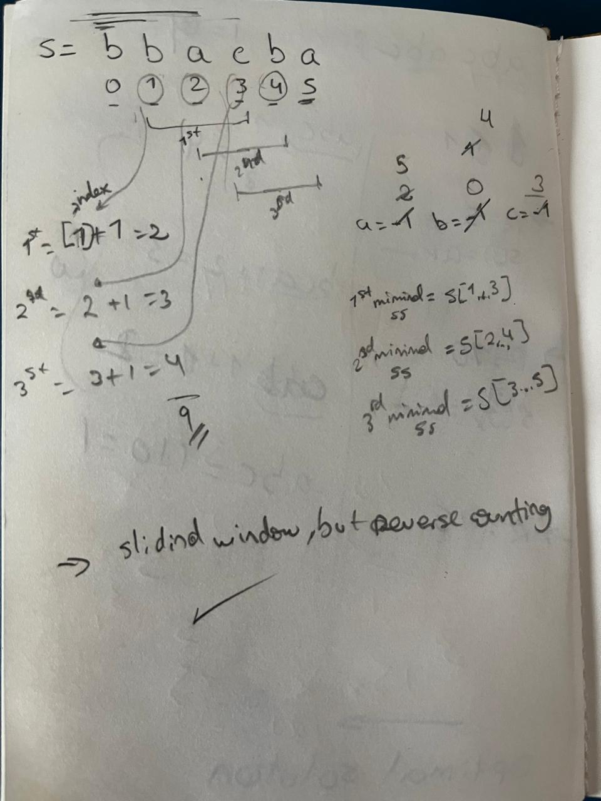

# **1358. Number of Substrings Containing All Three Characters**

### Example 1:
```plaintext
Input: s = "abcabc"
Output: 10
Explanation: The substrings containing at least one occurrence of the characters a, b and c are "abc", "abca", "abcab", "abcabc", "bca", "bcab", "bcabc", "cab", "cabc" and "abc" (again).
```

### Example 2:
```plaintext
Input: s = "aaacb"
Output: 3
Explanation: The substrings containing at least one occurrence of the characters a, b and c are "aaacb", "aacb" and "acb".
```

### Example 3:
```plaintext
Input: s = "abc"
Output: 1
```

# Solution



