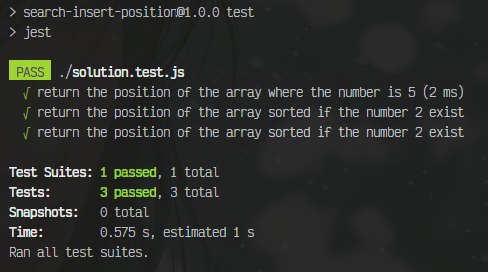
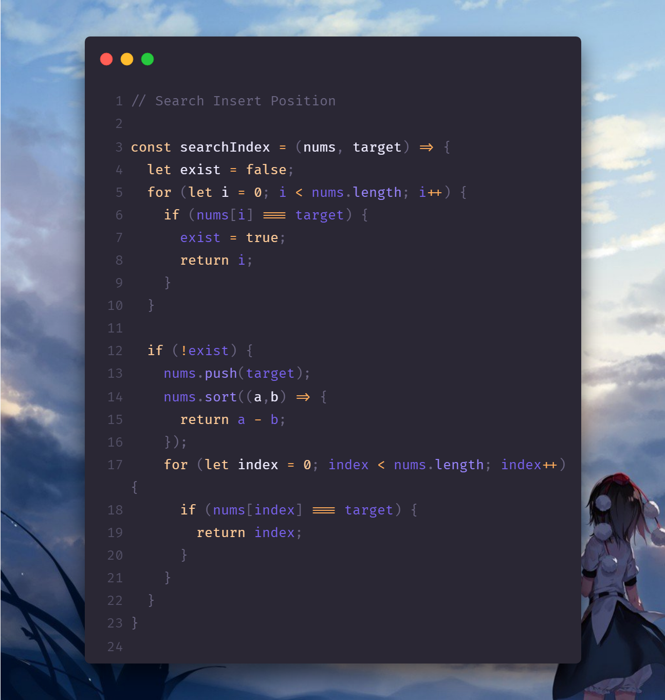

# Search Insert Position

Given a sorted array of distinct integers and a target value, return the index if the target is found. If not, return the index where it would be if it were inserted in order.

>You must write an algorithm with ```O(log n)``` runtime complexity.

---

## Example 1:
```javascript
Input: nums = [1,3,5,6], target = 5
Output: 2
```

## Example 2:
```javascript
Input: nums = [1,3,5,6], target = 2
Output: 1
```
## Example 3:
```javascript
Input: nums = [1,3,5,6], target = 7
Output: 4
```
---

# **_Solution_**:





