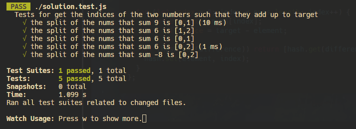
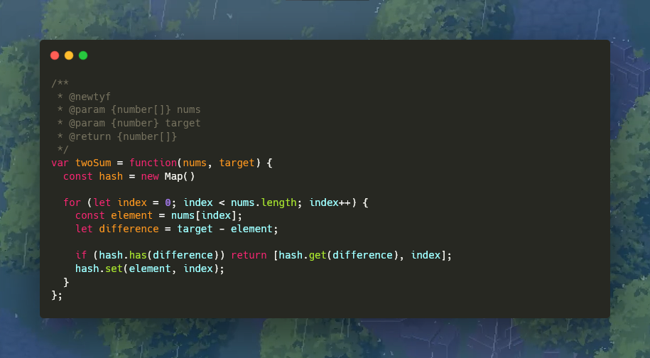

# **1. Two Sum**

Example 1:
```javascript
Input: nums = [2,7,11,15], target = 9
Output: [0,1]
Explanation: Because nums[0] + nums[1] == 9, we return [0, 1].
```


Example 2:
```javascript
Input: nums = [2,7,11,15], target = 9
Output: [0,1]
Explanation: Because nums[0] + nums[1] == 9, we return [0, 1].
```

Example 3:
```javascript
Input: nums = [3,3], target = 6
Output: [0,1]
```

# Solution

