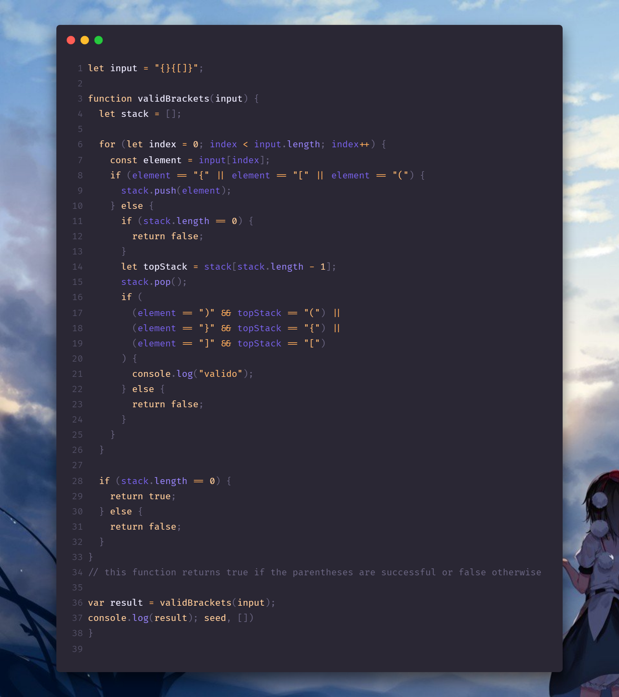

# brackets válidos

Dada una cadena que contiene solo los caracteres ` ( ` , ` ) ` , ` { ` , ` } ` , ` [ ` y ` ] `, determine si la cadena de entrada es válida.

### Una cadena de entrada es válida si:
1. Los corchetes abiertos deben cerrarse con el mismo tipo de corchetes.
2. Los paréntesis abiertos deben cerrarse en el orden correcto.

## Ejemplo 1:
```
Entrada: s = "()"
Salida: verdadero
```

## Ejemplo 2:
```
Entrada: s = "()[]{}"
Salida: verdadero
```

## Ejemplo 3:
```
Entrada: s = "(]"
Salida: falso
```

---
## **_Solution_:**


