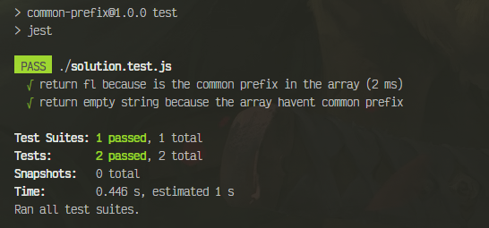
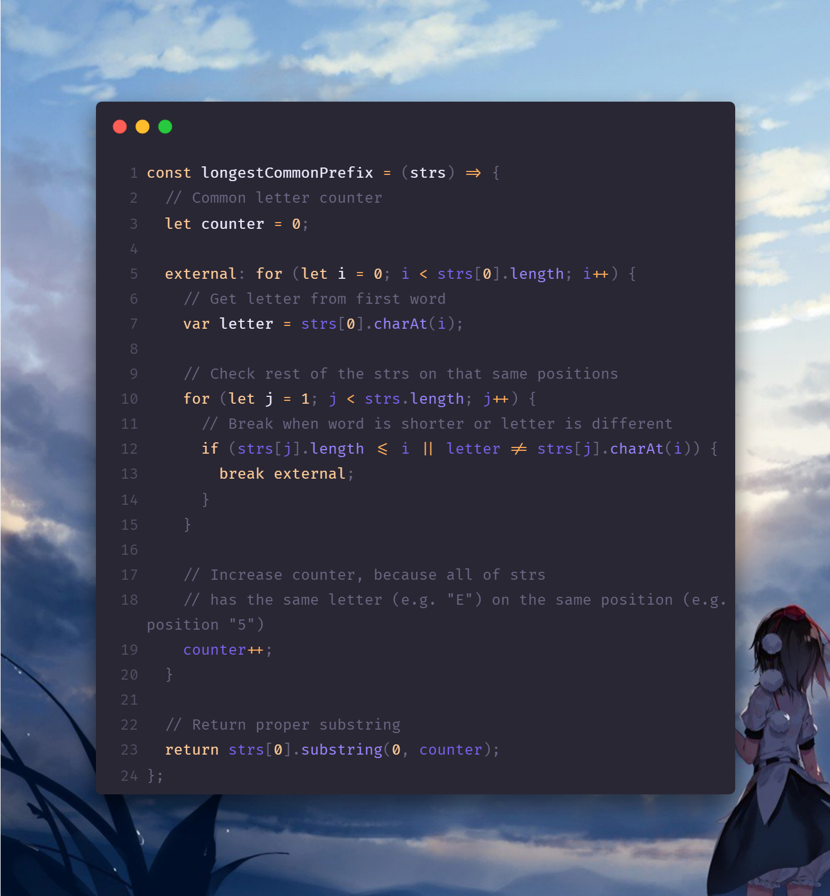

#  Longest Common Prefix
Write a function to find the longest common prefix string amongst an array of strings.

If there is no common prefix, return an empty string ```""```.

## Example 1:

```javascript
Input: strs = ["flower","flow","flight"]
Output: "fl"
```

## Example 2:

```javascript
Input: strs = ["dog","racecar","car"]
Output: ""

//Explanation: There is no common prefix among the input strings.
```
---
# _**Solution**_:


