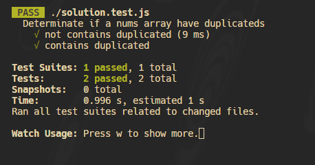
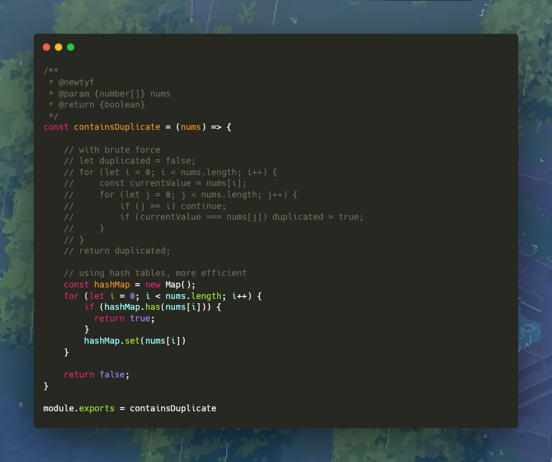

# **Contains Duplicate**

Example 1:
```javascript
Input: nums = [1,2,3,1]
Output: true
Explanation:
The element 1 occurs at the indices 0 and 3.
```


Example 2:
```javascript
Input: nums = [1,2,3,4]
Output: false
Explanation:
All elements are distinct.
```

# Solution


